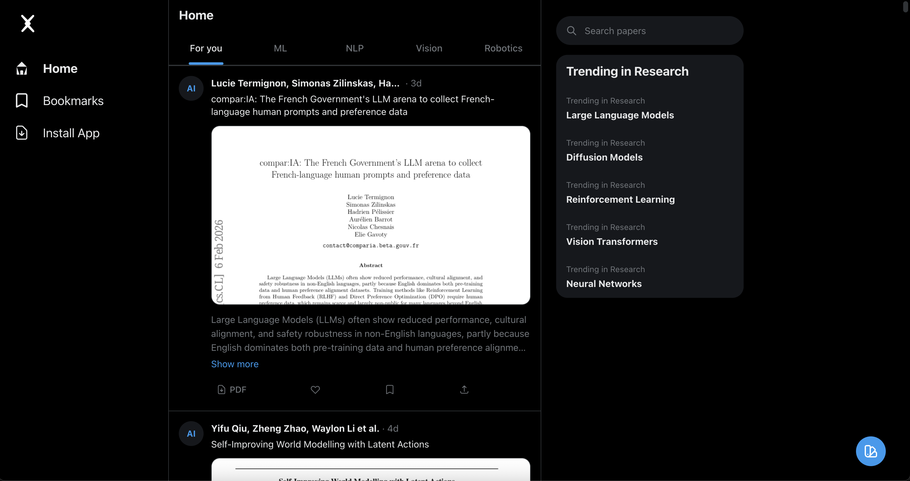

# Xapers



**Xapers** is an addictive, X/Twitter-style feed for browsing arXiv research papers. Discover the latest in AI, ML, NLP, and Computer Vision with a familiar infinite scroll experience.

## Inspiration

This project was heavily inspired by **[Xikipedia](https://xikipedia.org)** by **[Rebane](https://x.com/rebane2001)** (@rebane2001).
The idea of a "doomscroller" interface for academic content was too good not to build for arXiv papers!


## Getting Started

1.  **Clone the repo**

    ```bash
    git clone https://github.com/GithubAnant/xapers.git
    cd xapers
    ```

2.  **Install dependencies**

    ```bash
    npm install
    ```

3.  **Environment Setup**
    Copy `.env.example` to `.env.local` and add your credentials:

    ```bash
    cp .env.example .env.local
    ```

4.  **Run Development Server**

    ```bash
    npm run dev
    ```

5.  **Open** [http://localhost:3000](http://localhost:3000)

## License

MIT
